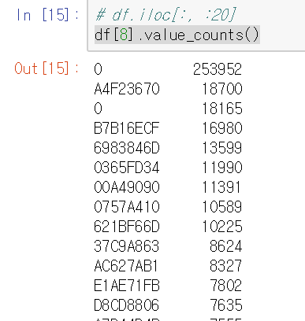

# Deprecated!!
초기 데이터셋에 오류가 있어 잘못된 분석입니다.

# lezhin-data-challenge
레진 데이터 챌린지 with 파이콘 한국 2017 

http://tech.lezhin.com/events/data-challenge-pyconkr-2017

위 문제를 Tensorflow로 접근하였습니다.

## TL;DR

* Tensorflow
  * DNN, 3 Hidden layer, ReLu
* 98~99% Accuracy 
  * 랜덤하게 7:3 = Learning set : Test set 분리함
  * 7번 시도
* Processing time : 241 seconds
  * 마지막 시도 기준

## Tensorflow 접근 방식

* DNN, Hidden layer는 3개의 ReLu
  * Hidden layer의 feature count는 기존 feature count에 0~2를 더함
* Dropout은 마지막 신경망을 제외한 앞의 2개에만 적용하였고, rate는 0.95
* Adam Optimizer
* ~~쓰던 코드 재활용~~

## Throubleshooting

* 9번째 컬럼, Hash인 feature를 묶어서 세아려보니, `Name: 8, Length: 5480, dtype: int64`
  * 
  * 0이 두개나 보임. Trash value?
  * Hash라서 [Categorical data](https://pandas.pydata.org/pandas-docs/stable/categorical.html)를 Numeric하게 변환하여도 갯수가 너무 많다보니 linear한 의미가 부여될까봐 걱정됨
  * One-hot encoding을 해서 flat하게 만들면, 너무 많은 feature가 생김
  * 일단, Hash feature을 무시하고 진행해보기로 함

* `ResourceExhaustedError: OOM when allocating tensor with shape[895431,174]`
  * batch로 나누어서 학습

## 개발 환경

* Windows 10
* i7 6700
* GTX 1080
* 16GB Memory
* Python 3.6.1 :: Anaconda 4.4.0 (64-bit)
* tensorflow-gpu==1.2.1
* numpy==1.12.1
* pandas==0.20.1
* scipy==0.19.0

## 기타

* 데이터는 커서 같이 올리지 않았습니다.

